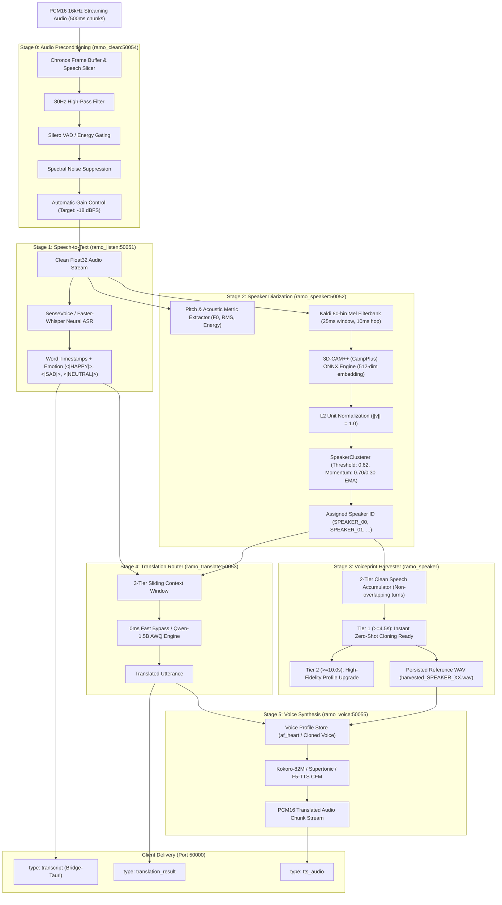

# 🛰️ ramO Audio Intelligence Pipeline: Architecture & Observability Plan

## 1. Executive Summary & Core Mandate

The ramO audio intelligence engine transforms streaming conversational audio into real-time transcriptions, multi-speaker diarization, semantic translation, and zero-shot voice synthesis.

To guarantee zero-assumption, deterministic debugging:
**Every single audio chunk, tensor transformation, model load state, feature extraction step, centroid cosine comparison, and harvester accumulation MUST emit transparent, structured, and unbuffered diagnostic logs.**

---

## 2. The 5-Month Battle-Tested Pipeline Architecture



---

## 3. Root Cause Analysis: Diarization Single-Speaker Degeneracy

### Problem Statement
In the multi-speaker benchmark test (`benchmark_turn_taking_3min.wav`) featuring 3 distinct speakers (Dr. Kenisha Zimmerman, Dr. Danny Benjamin, Dr. Mike Smith), all 32 turns were incorrectly assigned to `SPEAKER_00`.

### Root Causes
1. **Missing Neural Model on Colab**:
   - `models/campplus.onnx` was not downloaded during Colab initialization in `deploy/serve_ramo_colab.py`.
   - `AudioSegmenter` silently fell back to an in-memory spectral moment projection with fixed random seed 42.
   - Spectral projection on Zoom-compressed speech produced near-identical cosine vectors ($\text{similarity} \approx 0.98 - 0.99$).
2. **Threshold Misalignment**:
   - `c:\ramo-audio` used a battle-tested threshold of `0.62`.
   - `c:\ramo-engine` was initialized with `0.75`. Even with true embeddings, a misaligned threshold causes split errors or over-clustering.
3. **Total Absence of Internal Model Telemetry**:
   - No log indicated whether ONNX session was active or fell back to spectral projection.
   - No log showed the chunk RMS, F0 pitch, mel frames, or embedding L2 norms.
   - No log showed pairwise cosine similarities between the current turn and existing centroids.

---

## 4. Chunk-Level Observability Protocol (The Zero-Assumption Law)

Every stage of `ramo_speaker` and the gateway pipeline MUST emit structured diagnostic logs with standard emoji prefixes:

### 4.1. Model Load Verification
```
[MODEL_INIT] 🔍 Probing CampPlus ONNX path: 'models/campplus.onnx' (exists=True, size=28.4MB)
[MODEL_INIT] 🧠 Loading CampPlus ONNX session with providers: ['CUDAExecutionProvider', 'CPUExecutionProvider']
[MODEL_INIT] ✅ CampPlus ONNX session READY | Input: 'fbank' [batch, frames, 80] | Output: 'embedding' [batch, 512]
```
*(If missing)*:
```
[MODEL_INIT] ❌ CRITICAL: 'models/campplus.onnx' NOT FOUND at 'models/campplus.onnx'!
[MODEL_INIT] ⚠️ FALLBACK WARNING: Using mathematical spectral moment projection (Expect reduced speaker discrimination).
```

### 4.2. Chunk Acoustic Analysis
```
[AUDIO_CHUNK] Samples: 32000 (2.00s) | Range: [-0.642, +0.718] | RMS: 0.0842 (-21.5 dBFS) | Estimated F0: 248.3 Hz
```

### 4.3. Feature & Embedding Extraction
```
[FBANK_EXTRACT] Extracted 198 frames x 80 mel bins (Kaldi compliant: 25ms window, 10ms hop)
[CAMPPLUS_INFER] ⚡ CampPlus ONNX inference: 512-d vector | Pre-norm: 14.821 | Post-norm: 1.0000 | Mean: 0.0012, Std: 0.0441
```

### 4.4. Centroid Comparison & Assignment
```
[DIAR_CLUSTER] 👥 Evaluating turn (2.00s, F0: 248Hz) against 2 active speaker centroids (Threshold: 0.62):
  -> Centroid 'SPEAKER_00': cos_sim = 0.4128 [NO MATCH]
  -> Centroid 'SPEAKER_01': cos_sim = 0.5891 [NO MATCH]
[DIAR_CLUSTER] 🌟 Max similarity 0.5891 < 0.6200 -> INITIALIZING NEW SPEAKER: 'SPEAKER_02'
[DIAR_CLUSTER] 📌 Active centroids updated: 3 total ('SPEAKER_00', 'SPEAKER_01', 'SPEAKER_02')
```
*(When matching)*:
```
[DIAR_CLUSTER] 👥 Evaluating turn (2.00s, F0: 132Hz) against 3 active speaker centroids (Threshold: 0.62):
  -> Centroid 'SPEAKER_00': cos_sim = 0.3811 [NO MATCH]
  -> Centroid 'SPEAKER_01': cos_sim = 0.8742 [MATCH!]
  -> Centroid 'SPEAKER_02': cos_sim = 0.4205 [NO MATCH]
[DIAR_CLUSTER] ✅ ASSIGNED TO 'SPEAKER_01' (sim=0.8742 >= 0.6200)
[DIAR_CLUSTER] 🔄 Updated centroid 'SPEAKER_01' with EMA (momentum=0.70): drift=0.0412
```

### 4.5. Harvester Accumulation & Readiness
```
[HARVESTER] 🎙️ Audio turn added for 'SPEAKER_02': +2.00s (Total accumulated: 4.80s / 10.00s)
[HARVESTER] 🚀 SPEAKER_02 reached TIER 1 (>=4.5s)! READY FOR INSTANT ZERO-SHOT CLONING!
[HARVESTER] 💾 Reference audio persisted to 'harvested_SPEAKER_02.wav' (76,800 samples, 16kHz PCM16)
```

---

## 5. Implementation Roadmap

| Step | Action Item | Target File(s) | Status |
| :--- | :--- | :--- | :--- |
| **Step 1** | Pipeline Architecture & Observability Plan | `docs/PIPELINE_OBSERVABILITY_PLAN.md` | ✅ Complete |
| **Step 2** | CampPlus ONNX Model Download in Colab Runner | `deploy/serve_ramo_colab.py`, `serve_ramo_injected.py` | ⏳ In Progress |
| **Step 3** | Robust Feature Extraction & Exhaustive Logging in Diarization | `services/diarization/src/ramo_speaker/segmenter.py`, `cluster.py`, `harvester.py` | ⏳ In Progress |
| **Step 4** | Gateway Integration & Pipeline Observability Hooks | `services/gateway/src/ramo_gateway/pipeline_client.py`, `server.py` | ⏳ In Progress |
| **Step 5** | Regression Verification & Multi-Speaker Benchmark Test | `tests/inspect_pipeline.py`, `pytest` | ⏳ In Progress |
